# Mini Twitter

(Developer: Robin Bosch)


[Live webpage](https://ci-pp4-mini-twitter.herokuapp.com/)

## Table of Content

1. [Project Goals](#project-goals)
    1. [User Goals](#user-goals)
2. [User Experience](#user-experience)
    1. [Target Audience](#target-audience)
    2. [User Requirements and Expectations](#user-requirements-and-expectations)
    3. [User Stories](#user-stories)
3. [Design](#design)
    1. [Design Choices](#design-choices)
    2. [Structure](#structure)
    3. [Database model](#database-models)
4. [Technologies Used](#technologies-used)
    1. [Languages](#languages)
    2. [Frameworks](#frameworks)
    3. [Tools](#tools)
5. [Features](#features)
6. [Validation and Testing](#validation-and-testing)
    1. [HTML Validation](#html-validation)
    2. [CSS Validation](#css-validation)
    3. [Accessibility](#accessibility)
    4. [Performance](#performance)
    5. [Device testing](#device-testing)
    6. [Browser compatibility](#browser-compatibility)
    7. [Testing user stories](#testing-user-stories)
7. [Bugs](#bugs)
8. [Deployment](#deployment)
9. [Credits](#credits)
    1. [Media](#media)
    2. [Code](#code)
    3. [Acknowledgements](#acknowledgements)
10. [License](#license)

## Project Goals

### User Goals

- Share the own opinions
- Get to know the other opinions
- Engage in a discussion with other users
- Vote on other opinions
- See only the opinions of people followed
- Search for shared opinions

### Site Owner Goals

- Engage in the discussion as well
- Build a small friendly community
- Remove unfriendly people
- Share own opinions

## User Experience

### Target Audience

- Everyone who has an opinion (only friendly people allowed though)
- People who like to discuss
- People interested in other opinions

### User Requirements and Expectations

- Easy to use
- Can Comment, Vote and Post
- Can also update and delete Comment, Vote and Post
- Follow other user or get followed
- Visit profile to see their post history

### User Stories

As a user I want to:

1. login into my account
2. register a new account
3. change my username
4. change my profile picture
5. see a user profile
6. create posts
7. update posts
8. delete posts
9. like and dislike posts
10. see likes and dislike on post
11. comment on Post
12. update comment
13. delete comment
14. follow/unfollow other users
15. see who follows me
16. see who I follow
17. search for other users
18. search for posts

As a owner I want to:

19. remove users and block their email address
22. remove posts
23. see the most recent posts on the platform

## Design

### Design Choices

The design is minimalistic. Its a simple bootstrap layout with colours and fonts from bootstrap. (First time using bootstrap on a real project).
The focus was heavily put on the conversation and the posts in front with no distractions, while still allowing the user to customise their experience.

### Structure

The MiniTwitter site main structure consists of home, posts and profiles.
Home shows all posts and allows to post as well, there is a customized feed to only see the posts from the profiles followed
and a search function which show profile and posts.
Posts show the posts in full and show comments. Posts can be commented and user can delete or update their own comment or post.
Profiles show the profile, posts the profile has posted as well as the following and follower list.
Settings are also available to the user to change the username, profile text, profile picture or password.
Register and Login sites are also available, only logged in user can create, update or delete posts and comments.

### Database models

#### User

- Is a custom modified user and replaces the original user model
- Contains these fields (email, password, username, user_text, user_picture, is_active, is_staff)

#### FollowRelation

- Show the follow relationship between two user
- Contains these fields (id, user, followed_user, followed_at)

#### Post

- Post represents one post and its content and time of creation
- Contains these fields (id, user, content, created_at)

#### PostVote

- PostVote is a vote on a post, the vote can be a like or a dislike
- Contains these fields (id, user, post, positive, voted_at)

#### PostComment

- PostComment represents one comment on one post and its content and time of creation
- Contains these fields (id, user, post, content, created_at)

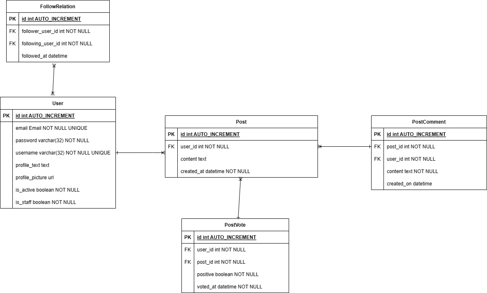

## Technologies Used  

### Languages

- HTML  
- CSS
- Python
- JavaScript

### Frameworks

- [Django](https://www.djangoproject.com/)
- [Bootstrap](https://getbootstrap.com/)
- [Font Awesome](https://fontawesome.com/icons)

### Python libraries

- cloudinary==1.30.0
- dj-database-url==1.2.0
- dj3-cloudinary-storage==0.0.6
- Django==4.1.4
- django-cloudinary-storage==0.3.0
- gunicorn==20.1.0
- Pillow==9.3.0
- psycopg2==2.9.5
- pycodestyle==2.10.0
- pylint==2.15.9
- python-dotenv==0.21.0

### Tools

- [Git](https://git-scm.com/)
- [GitHub](https://github.com/)
- [diagrams.net](https://www.diagrams.net/)
- [Visual Studio Code](https://code.visualstudio.com/)
- [Balsamiq](https://balsamiq.com/)

## Features

### Header

- Shows the logo, search bar and user buttons
- User buttons switch between login, register and profile picture, settings, logout
- User stories covered: 1, 2, 17, 18

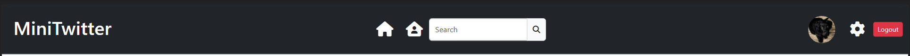

### Register

- Shows the register form
- Has the email, username, password and password confirm field
- User stories covered: 2

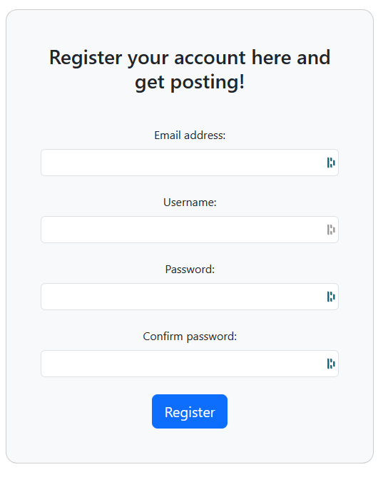

### Login

- Shows the login form
- Has the email, password field
- User stories covered: 1

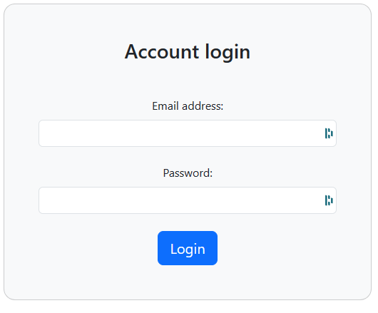

### Add post

- Shows small form to add a post
- User stories covered: 6

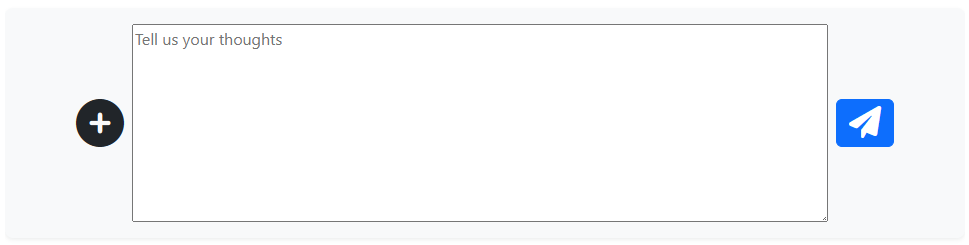

### Post list

- Shows a list of posts
- Posts contain: user, profile picture, date posted, content, message count, like/dislike ratio, the vote of the user
- Links to the singular post view, which also shows the comments
- User stories covered: 10

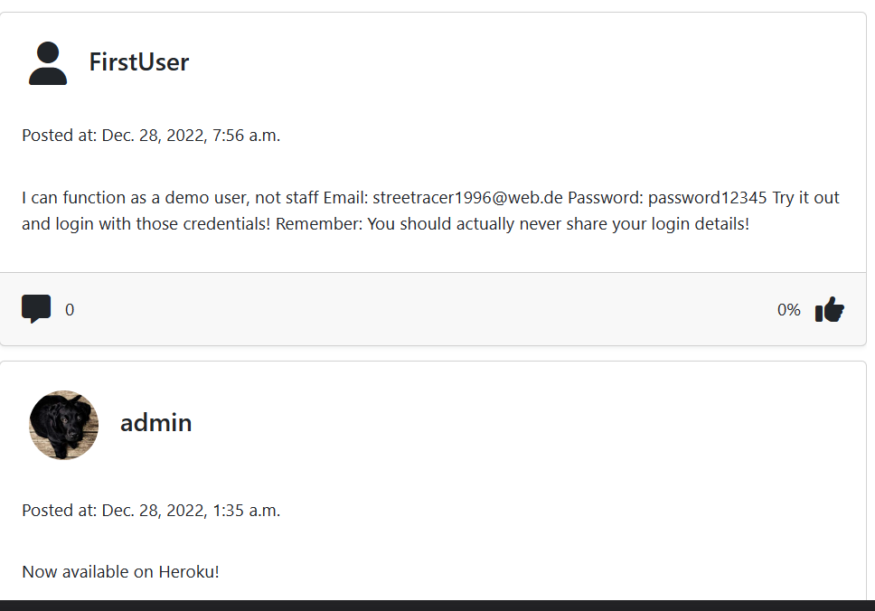

### Post view

- Shows the single post
- Posts contain: user, profile picture, date posted, content, message count, like/dislike ratio, the vote of the user
- Has a section to add a comment
- Allows for to reach the editing page for comments and posts
- Post can be deleted from here
- User stories covered: 9, 10, 11, 12, 13

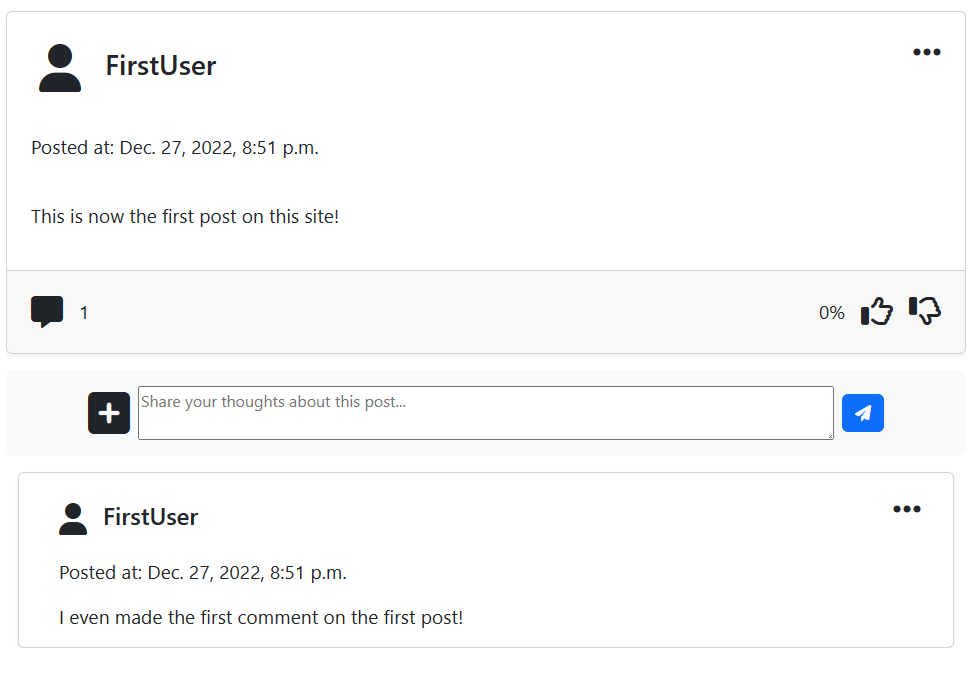

### Edit post

- Allows to edit the post
- Has a textbox the current post content
- User stories covered: 7

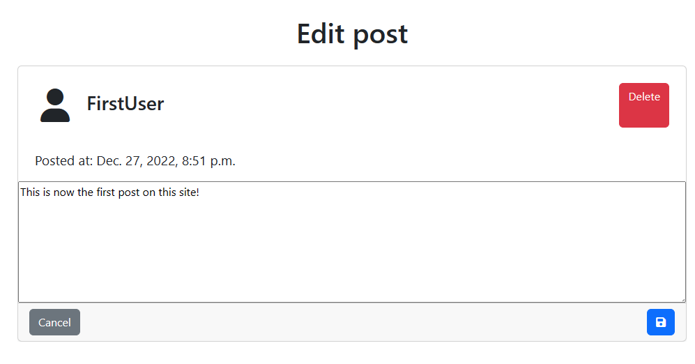

### Edit comment

- Allows to edit the post
- Has a textbox the current comment content
- User stories covered: 12, 13

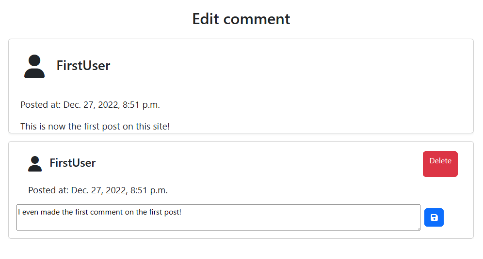

### Search results

- Shows the search results for user and posts
- Has a search term at the top and the user and post list
- User stories covered: 17, 18

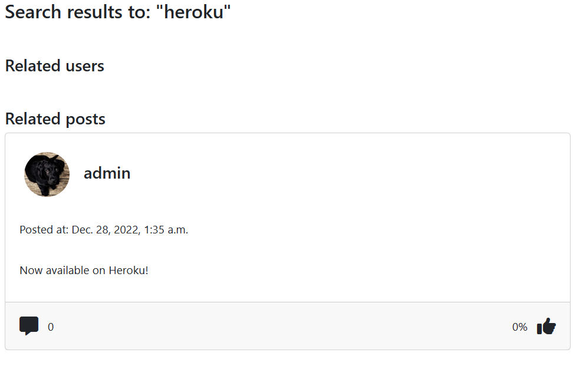

### Feed

- Show a post list of only user followed
- Only accessable to logged in user
- Shows the add post form

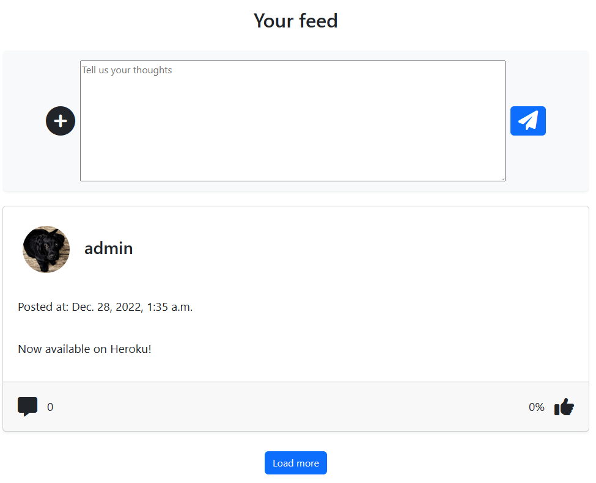

### Profile

- Shows the profile and their post history
- Has links to following and follower list
- User stories covered: 5, 14

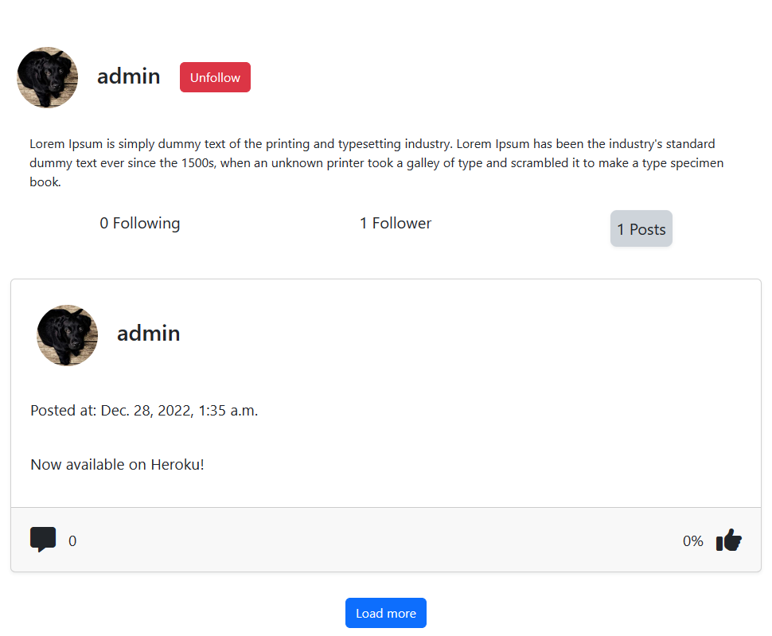

### Follow list

- Shows the list of following or follower
- Links to the profiles aswell
- User stories covered: 15, 16

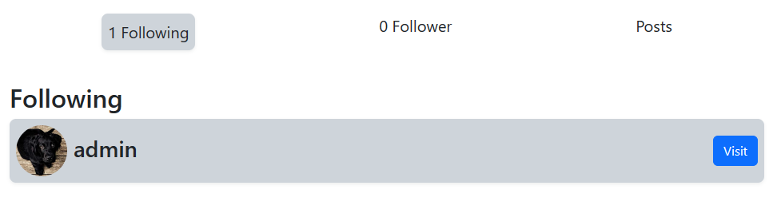

### User settings

- Allows to change the user settings
- Username, profile text and profile picture can be changed
- User stories covered: 3, 4

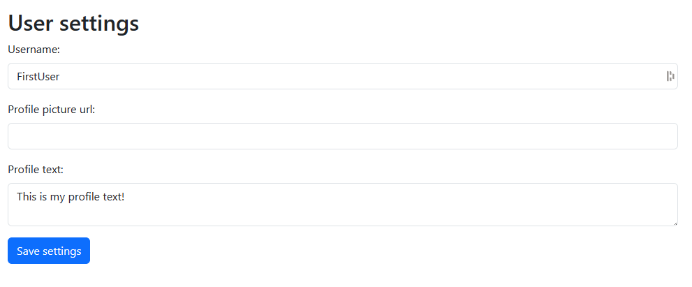

### Change password

- Allows the user to change the password
- Asks for confirmation of the new password as safeguard

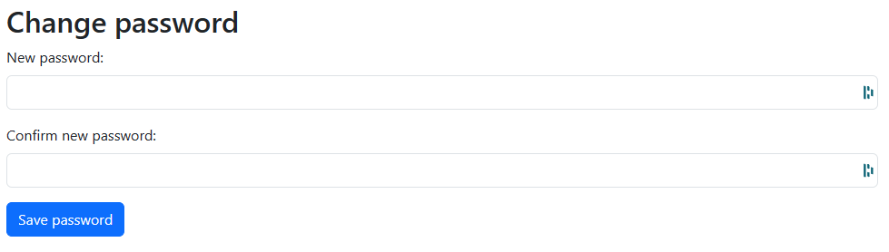

## Validation and Testing


### HTML Validation

All HTML validation tests have been passed.  

<details>
 <summary>Index page</summary>
 
</details>

<details>
 <summary>404 page</summary>
 
</details>

### CSS Validation

The full website gets errors in the CSS validation test from the font awesome framework.  
Validating the single files passes the tests.  
Variables can't be validated, they show up as warnings.  

<details>
 <summary>Modals CSS</summary>
 
</details>

<details>
 <summary>Reset CSS</summary>
 
</details>

<details>
 <summary>Styles CSS</summary>
 
</details>

<details>
 <summary>Notifications CSS</summary>
 
</details>

### Python validation

### Accessibility

All Wave accessibility tests pass with a few alerts.

<details>
 <summary>Index page</summary>
 
</details>


### Performance

The lighthouse tests were good.  
Below are all reports to every page.

<details>
 <summary>Summary</summary>
 
 <br>
 <a href="docs/validation/lighthouse/lighthouse-report-index.pdf">Read full report to Index page (PDF)</a>
</details>

### Device testing

The website was tested on the following devices:

- Windows 11 PC (Screen resolution: 2560x1440)
- Xiaomi MI 9 with Android 11 (Screen resolution: 1080x2280)

Other screen resolutions were tested in the browser with dev tools from 2560x1440 down to 320x568.

### Browser compatibility

The following browser were tested:

- Microsoft Edge (Chromium based version)
- Google Chrome
- Mozilla Firefox

Webkit based browser (Safari) could not be tested. Chromium based and Quantum based browser should be working.

### Testing user stories

#### As a user I want to

1. login into my account

|Feature|Action|Expected result|Actual result|
|---|---|---|---|
Login form|Click on login button at the top right, and fill in the form|The login form opens up|Works as expected|

2. register a new account

|Feature|Action|Expected result|Actual result|
|---|---|---|---|
Register form|Click on register button at the top right, and fill in the form|The register form opens up|Works as expected|

3. change my username

|Feature|Action|Expected result|Actual result|
|---|---|---|---|
User settings|While logged in click on the settings gear icon and fill in the username in the user settings form|User settings open up and username is saved|Works as expected|

4. change my profile picture

|Feature|Action|Expected result|Actual result|
|---|---|---|---|
User settings|While logged in click on the settings gear icon and fill in the profile picture link in the user settings form|User settings open up and profile picture is saved|Works as expected|

5. see a user profile

|Feature|Action|Expected result|Actual result|
|---|---|---|---|
Profile|Click on any username or profile picture|User is redirected to profile|Works as expected|

6. create posts

|Feature|Action|Expected result|Actual result|
|---|---|---|---|
Create post form|While logged in on the feed or home, fill in the create post form|Post is saved and displayed|Works as expected|

7. update posts

|Feature|Action|Expected result|Actual result|
|---|---|---|---|
Edit post|Click on own post, at the top right click the three dots and edit, change content in the textbox and save|Post is updated|Works as expected|

8. delete posts

|Feature|Action|Expected result|Actual result|
|---|---|---|---|
Delete post|Click on own post, at the top right click the three dots and select delete and confirm|Post is deleted|Works as expected|

9. Like and dislike posts

|Feature|Action|Expected result|Actual result|
|---|---|---|---|
|Like and dislike button|While logged in, open any post and click the like or dislike button|Post is liked/disliked|Works as expected|

10. See likes and dislikes on post

|Feature|Action|Expected result|Actual result|
|---|---|---|---|
|Post list|Look at the bottom right of any post, it shows the like/dislike ratio|Shows like/dislike ratio|Works as expected|

11. comment on post 

|Feature|Action|Expected result|Actual result|
|---|---|---|---|
|Comment add form on post|While logged in, open any post and add text to the textbox below and click add|Adds a comment to a post|Works as expected|

12. update comment 

|Feature|Action|Expected result|Actual result|
|---|---|---|---|
|Edit comment form|While logged in, open a post, navigate to the comment and click the three dots at the top right and click edit, the fill out the textbox and save|Updates comment|Works as expected|

13. delete comment

|Feature|Action|Expected result|Actual result|
|---|---|---|---|
|Delete comment button|While logged in, open a post, navigate to the comment and click the three dots at the top right and click edit, now click the delete button and confirm|Deletes a comment|Works as expected|

14. follow/unfollow other users

|Feature|Action|Expected result|Actual result|
|---|---|---|---|
|Follow/Unfollow button on profile|While logged in, navigate to a profile and click the Follow/Unfollow button|Follows or Unfollows a user|Works as expected|

15. see who follows me 

|Feature|Action|Expected result|Actual result|
|---|---|---|---|
|Follower view on profile|Click on own profile (top right while logged in), click followers|Shows follower list|Works as expected|

16. see who I follow

|Feature|Action|Expected result|Actual result|
|---|---|---|---|
|Following view on profile|Click on own profile (top right while logged in), click followers|Shows following list|Works as expected|

17. search for other users
18. search for posts

|Feature|Action|Expected result|Actual result|
|---|---|---|---|
|Searchbar|Enter any text in the searchbar at the top and click search|Shows search results for posts and users|Works as expected|


#### As a owner I want to

19. remove users and block their email address

|Feature|Action|Expected result|Actual result|
|---|---|---|---|
|Switch active action|In the admin panel navigate to the user table, select any user and choose the action switch active in the dropdown|Switches the active status of a user|Works as expected|

20. remove posts

|Feature|Action|Expected result|Actual result|
|---|---|---|---|
|remove post action|In the admin panel navigate to the posts table and select the post and choose the delete action|Deletes any post selected|Works as expected|

21. see the most recent posts on the platform

|Feature|Action|Expected result|Actual result|
|---|---|---|---|
|Sort post table|In the admin panel navigate to the posts table and click on the created at column to sort by date|Shows the most recent post on the platform at the top|Works as expected|

## Bugs

|Status|Bug|Fix|
|---|---|---|
||||

## Deployment

Local deployment:

1. Follow the clone steps below and go to step 2
2. Run the following command to install all required packages

```
pip install -r requirements.txt
```

3. Create a .env file and add the following keys to it:
    - CLOUDINARY_URL --> Url to your cloudinary storage
    - DATABASE_URL --> Your link to your postgres database
    - DEBUG --> Set either to True or False
    - SECRET_KEY --> A random secret key, can be anything
4. Enter the following command to start up the server:

```
python3 manage.py runserver
```

5. The package can now be accessed locally under [localhost:8000](https://localhost:8000)
6. Don't forget to create a super user to access the admin panel with the following command:

```
python3 manage.py createsuperuser
```

Heroku:

1. Create an account at Heroku and login.
2. Click the "Create new app" button on your dashboard, add app name and region.
3. Click on the "Create app" button.
4. Click on the "Settings" tab.
5. Under "Config Vars" click "Reveal Config Vars" add the following keys:
    - CLOUDINARY_URL --> Url to your cloudinary storage
    - DATABASE_URL --> Your link to your postgres database
    - DEBUG --> Set either to True or False
    - SECRET_KEY --> A random secret key, can be anything
6. Under "Buildpacks" click "Add buildpack" and then choose "Python" first and click "Save changes"
7. Go to the "Deploy" tab and choose GitHub as your deployment method
8. Connect your GitHub account
9. Enter your repository name, search for it and click connect when it appears below.
10. In the manual deploy section click "Deploy branch"
11. Optional: You can enable automatic deploys if you want the app to automatically update

You can fork the repository by following these steps:

1. Go to the repository on GitHub  
2. Click on the "Fork" button in the upper right hand corner

You can clone the repository by following these steps:

1. Go to the repository on GitHub
2. Locate the "Code" button above the list of files and click it  
3. Select if you prefer to clone using HTTPS, SSH, or Github CLI and click the "copy" button to copy the URL to your clipboard
4. Open Git Bash
5. Change the current working directory to the one where you want the cloned directory
6. Type git clone and paste the URL from the clipboard ($ git clone <https://github.com/YOUR-USERNAME/YOUR-REPOSITORY>)  
7. Press Enter to create your local clone.

## Credits

### Media

Icons are taken from Font Awesome:  
[FontAwesome](<https://fontawesome.com/>)

### Code

CSS Reset has been used in the reset.css file.  
It was written by Andy Bell in a blog post:  
[Blog post](<https://piccalil.li/blog/a-modern-css-reset/>)

Guides on Flexbox and Grid from CSS-Tricks, that have been used multiple times as a reference.  
[Complete Guide to Grid](<https://css-tricks.com/snippets/css/complete-guide-grid/>)  
[Complete Guide to Flexbox](<https://css-tricks.com/snippets/css/a-guide-to-flexbox/>)  

### Acknowledgements

- A special thanks to my mentor Mo Shami for his feedback and advice, especially on the documentation.
- A thanks to the Code Institute for the great learning resources

## License

This project is published under the MIT license.  
[License](/LICENSE.txt)