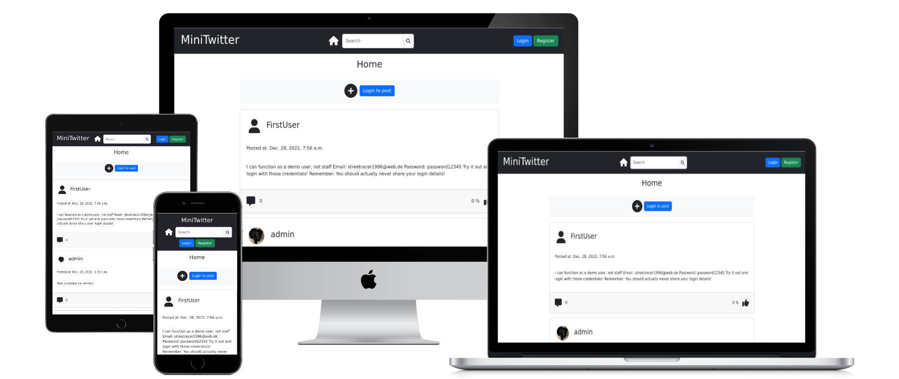

# Mini Twitter

(Developer: Robin Bosch)



[Live webpage](https://ci-pp4-mini-twitter.herokuapp.com/)

## Table of Content

1. [Project Goals](#project-goals)
    1. [User Goals](#user-goals)
2. [User Experience](#user-experience)
    1. [Target Audience](#target-audience)
    2. [User Requirements and Expectations](#user-requirements-and-expectations)
    3. [User Stories](#user-stories)
3. [Design](#design)
    1. [Design Choices](#design-choices)
    2. [Colors](#colors)
    3. [Fonts](#fonts)
    4. [Structure](#structure)
    5. [Wireframes](#wireframes)
4. [Technologies Used](#technologies-used)
    1. [Languages](#languages)
    2. [Frameworks](#frameworks)
    3. [Tools](#tools)
    4. [Pages](#pages)
5. [Features](#features)
6. [Validation and Testing](#validation-and-testing)
    1. [HTML Validation](#html-validation)
    2. [CSS Validation](#css-validation)
    3. [JavaScript Validation](#javascript-validation)
    4. [Accessibility](#accessibility)
    5. [Performance](#performance)
    6. [Device testing](#device-testing)
    7. [Browser compatibility](#browser-compatibility)
    8. [Testing user stories](#testing-user-stories)
7. [Bugs](#bugs)
8. [Deployment](#deployment)
9. [Credits](#credits)
    1. [Media](#media)
    2. [Code](#code)
    3. [Acknowledgements](#acknowledgements)
10. [License](#license)

## Project Goals

### User Goals

- Share the own opinions
- Get to know the other opinions
- Engage in a discussion with other users
- Vote on other opinions
- See only the opinions of people followed
- Search for shared opinions

### Site Owner Goals

- Engage in the discussion as well
- Build a small friendly community
- Remove unfriendly people
- Share own opinions

## User Experience

### Target Audience

- Everyone who has an opinion (only friendly people allowed though)
- People who like to discuss
- People interested in other opinions

### User Requirements and Expectations

- Easy to use
- Can Comment, Vote and Post
- Can also update and delete Comment, Vote and Post
- Follow other user or get followed
- Visit profile to see their post history

### User Stories

As a user I want to:

1. login into my account
2. register a new account
3. change my username
4. change my profile picture
5. see a user profile
6. create posts
7. update posts
8. delete posts
9. like and dislike posts
10. see likes and dislike on post
11. comment on Post
12. update comment
13. delete comment
14. update post
15. follow/unfollow other users
16. see who follows me
17. see who I follow
18. search for other users
19. search for posts

As a owner I want to:

20. remove users and block their email address
21. see who has recently registered
22. remove posts
23. see the most recent posts on the platform

## Design

### Design Choices

### Colors

### Fonts

The Inter font from Google Fonts was chosen for its visual clarity. It is easily readable and friendly to the eye. The second font is sans-serif if the font is not loading.  
[Link to Inter font](<https://fonts.google.com/specimen/Inter>)

### Structure

#### Notifications

There are notification popups in the bottom right corner for warnings or reminders. They disappear after a short time or can be closed with the button.

### Wireframes

<details>
 <summary>Home</summary>
 
</details>
<details>
 <summary>Create/Edit task modal</summary>
 
</details>
<details>
 <summary>User settings modal</summary>
 
</details>
<details>
 <summary>Newsletter modal</summary>
 
</details>
<details>
 <summary>404 page</summary>
 
</details>

## Technologies Used  

### Languages

- HTML  
- CSS
- Python
- JavaScript

### Frameworks

- Django
- Bootstrap
- Font Awesome
- Google Fonts

### Tools

- Git
- GitHub
- Visual Studio Code
- Balsamiq

### Pages

- [CSS Generators](<https://html-css-js.com/css/generator>) (to generate effects like drop shadows)

## Features

## Validation and Testing

### HTML Validation

All HTML validation tests have been passed.  

<details>
 <summary>Index page</summary>
 
</details>

<details>
 <summary>404 page</summary>
 
</details>

### CSS Validation

The full website gets errors in the CSS validation test from the font awesome framework.  
Validating the single files passes the tests.  
Variables can't be validated, they show up as warnings.  

<details>
 <summary>Modals CSS</summary>
 
</details>

<details>
 <summary>Reset CSS</summary>
 
</details>

<details>
 <summary>Styles CSS</summary>
 
</details>

<details>
 <summary>Notifications CSS</summary>
 
</details>

### Accessibility

All Wave accessibility tests pass with a few alerts.

<details>
 <summary>Index page</summary>
 
</details>


### Performance

The lighthouse tests were good.  
Below are all reports to every page.

<details>
 <summary>Index page</summary>
 
 <br>
 <a href="docs/validation/lighthouse/lighthouse-report-index.pdf">Read full report to Index page (PDF)</a>
</details>

### Device testing

The website was tested on the following devices:

- Windows 11 PC (Screen resolution: 2560x1440)
- Xiaomi MI 9 with Android 11 (Screen resolution: 1080x2280)

Other screen resolutions were tested in the browser with dev tools from 2560x1440 down to 320x568.

### Browser compatibility

The following browser were tested:

- Microsoft Edge (Chromium based version)
- Google Chrome
- Mozilla Firefox

Webkit based browser (Safari) could not be tested. Chromium based and Quantum based browser should be working.

### Testing user stories

#### As a user I want to

1. View all my tasks

|Feature|Action|Expected result|Actual result|
|---|---|---|---|
Task list|The list is to the left or can be expanded with the menu toggle on the left|Task list can be viewed|Works as expected|

<details>
 <summary>Screenshot</summary>

 <br>
 
</details>

## Bugs

|Status|Bug|Fix|
|---|---|---|
||||

## Deployment

Local deployment:

1. Follow the clone steps below and go to step 2
2. Run the following command to install all required packages

```
pip install -r requirements.txt
```

3. Create a .env file and add the following keys to it:
    - CLOUDINARY_URL --> Url to your cloudinary storage
    - DATABASE_URL --> Your link to your postgres database
    - DEBUG --> Set either to True or False
    - SECRET_KEY --> A random secret key, can be anything
4. Enter the following command to start up the server:

```
python3 manage.py runserver
```

5. The package can now be accessed locally under [localhost:8000](https://localhost:8000)
6. Don't forget to create a super user to access the admin panel with the following command:

```
python3 manage.py createsuperuser
```

Heroku:

1. Create an account at Heroku and login.
2. Click the "Create new app" button on your dashboard, add app name and region.
3. Click on the "Create app" button.
4. Click on the "Settings" tab.
5. Under "Config Vars" click "Reveal Config Vars" add the following keys:
    - CLOUDINARY_URL --> Url to your cloudinary storage
    - DATABASE_URL --> Your link to your postgres database
    - DEBUG --> Set either to True or False
    - SECRET_KEY --> A random secret key, can be anything
6. Under "Buildpacks" click "Add buildpack" and then choose "Python" first and click "Save changes"
7. Go to the "Deploy" tab and choose GitHub as your deployment method
8. Connect your GitHub account
9. Enter your repository name, search for it and click connect when it appears below.
10. In the manual deploy section click "Deploy branch"
11. Optional: You can enable automatic deploys if you want the app to automatically update

You can fork the repository by following these steps:

1. Go to the repository on GitHub  
2. Click on the "Fork" button in the upper right hand corner

You can clone the repository by following these steps:

1. Go to the repository on GitHub
2. Locate the "Code" button above the list of files and click it  
3. Select if you prefer to clone using HTTPS, SSH, or Github CLI and click the "copy" button to copy the URL to your clipboard
4. Open Git Bash
5. Change the current working directory to the one where you want the cloned directory
6. Type git clone and paste the URL from the clipboard ($ git clone <https://github.com/YOUR-USERNAME/YOUR-REPOSITORY>)  
7. Press Enter to create your local clone.

## Credits

### Media

Icons are taken from Font Awesome:  
[FontAwesome](<https://fontawesome.com/>)

### Code

CSS Reset has been used in the reset.css file.  
It was written by Andy Bell in a blog post:  
[Blog post](<https://piccalil.li/blog/a-modern-css-reset/>)

Guides on Flexbox and Grid from CSS-Tricks, that have been used multiple times as a reference.  
[Complete Guide to Grid](<https://css-tricks.com/snippets/css/complete-guide-grid/>)  
[Complete Guide to Flexbox](<https://css-tricks.com/snippets/css/a-guide-to-flexbox/>)  

### Acknowledgements

- A special thanks to my mentor Mo Shami for his feedback and advice, especially on the documentation.
- A thanks to the Code Institute for the great learning resources

## License

This project is published under the MIT license.  
[License](/LICENSE.txt)